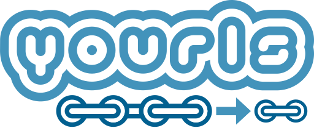

<h1 align="center">
  
</h1>

> Your Own URL Shortener

     

**YOURLS** is a set of PHP scripts that will allow you to run <strong>Y</strong>our <strong>O</strong>wn <strong>URL</strong> <strong>S</strong>hortener, on **your** server. You'll have full control over your data, detailed stats, analytics, plugins, and more. It's free and open-source.

## Quick Start

Get YOURLS :
* Download the latest [release](https://github.com/YOURLS/YOURLS/releases)
* Using Composer? You can simply `composer create-project yourls/yourls .` in an empty directory.

Install YOURLS:
* Read [yourls.org](https://yourls.org) for starters
* The complete documentation is on [docs.yourls.org](https://docs.yourls.org) and contains everything from beginners to experts.

## Community news, tips and tricks

* Read and subscribe to the [The Official YOURLS Blog](http://blog.yourls.org)
* Check what the user community makes: plugins, tools, guides and more on [Awesome YOURLS](https://github.com/YOURLS/awesome-yourls)
* Engage users and ask for help in our [community discussions](https://github.com/YOURLS/YOURLS/discussions)
* Keep track of development: "Star" and "Watch" this project, follow [commit messages](https://github.com/YOURLS/YOURLS/commits/master)

## Contributing

Feature suggestion? Bug to report?

__Before opening any issue, please search for existing [issues](https://github.com/YOURLS/YOURLS/issues) (open and closed) and read the [Contributing Guidelines](https://github.com/YOURLS/.github/blob/master/CONTRIBUTING.md).__

## Backers

Do you use and enjoy YOURLS? [Become a backer](https://opencollective.com/yourls#backer) and show your support to our open source project.

## Sponsors

Does your company use YOURLS? Ask your manager or marketing team if your company would be interested in supporting our project. Your company logo will show here. Help support our open-source development efforts by [becoming a sponsor](https://opencollective.com/yourls).

## License

Free software. Do whatever the hell you want with it.  
YOURLS is released under the [MIT license](LICENSE).
